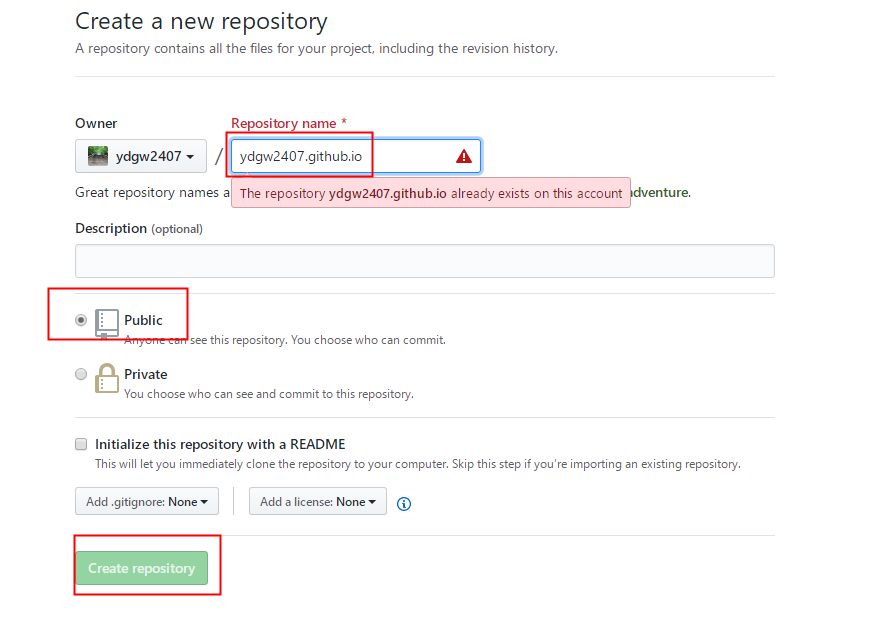

## 10分钟基于Github从零开始搭建页面

### Github 准备工作

#### 打开 Github 官网， https://github.com/，申请注册一个账号。

#### 创建一个名为【账户名.github.io】的仓库

假设账号是： ```ydgw2407```，则建立博客仓库名为：```ydgw2407.github.io```。

- 1.创建仓库

将仓库属性选择为公开的：public。



- 2.设置仓库的github页面属性

进入仓库，点击 ```settings``` 选项，下拉到 **GitHub Pages** 相关选项。
点击设置主题： ```Change theme``` 按钮，选择默认的主题 Cayman，点击选择：```Select theme```


回到仓库的主页（即仓库--->settings，刚才的Github Pages页面），可以看到提示，页面设置成功了：


您就可以在浏览器输入： https://ydgw2407.github.io/，访问了：


- 3.设置页面完成后，可以看到该仓库生成了2个文件：


