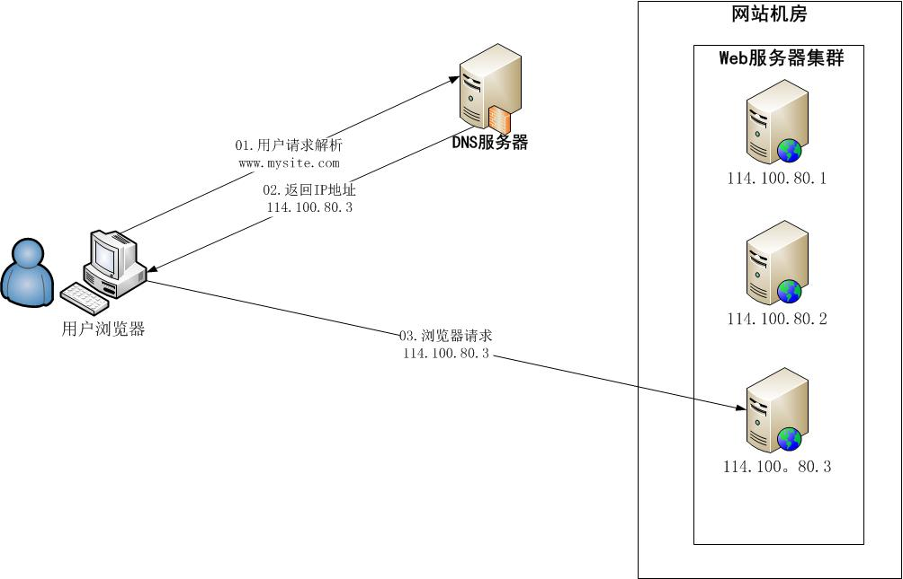
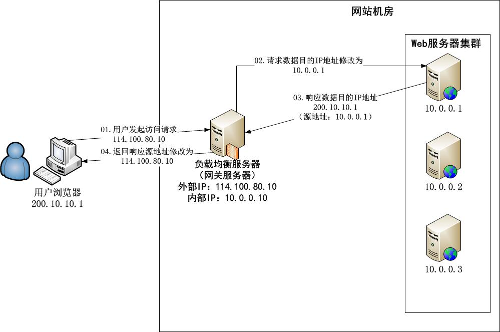
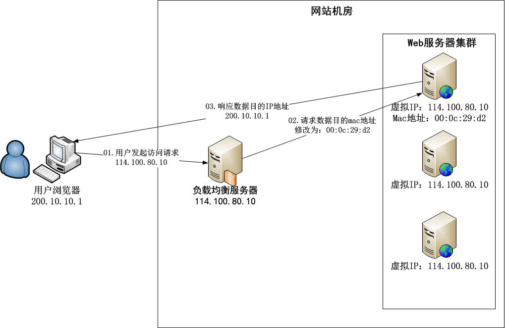

# 负载均衡实现实践

## 负载均衡技术

负载均衡实现多种，硬件到软件，商业的、开源的。常见的负载均衡方式：

### HTTP重定向负载均衡（较差）

需要**HTTP重定向服务器**。

#### 流程

- 浏览器先去HTTP重定向服务器请求，获取到实际被定向到的服务器；浏览器再请求被实际定向到的服务器。

#### 特点

简单易实现。

#### 缺点

- 浏览器需要两次请求才能完成一次完整的访问，性能以及体验太差。
- 依赖于**重定向服务器**自身处理能力，集群伸缩性规模有限。
- 使用HTTP 302进行重定向可能使搜索引擎判断为SEO作弊，降低搜索排名。


#### 部署架构图


### DNS域名解析负载均衡（一般）

需要**DNS服务器**。

#### 流程

- 浏览器请求某个域名，DNS服务器返回web服务器集群中的某个ip地址。
- 浏览器再去请求DNS返回的服务器地址。


#### 特点

该方案要要求在DNS服务器中配置多个A记录，例如：

|www.example.com IN A|10.192.168.66|
|:---|:---|
|www.example.com IN A|10.192.168.77|
|www.example.com IN A|10.192.168.88|

该方案将负载均衡的工作交给了DNS，节省了网站管理维护负载均衡服务器的麻烦。

#### 缺点

- 目前的DNS是**多级解析**的，每一级别都可能缓存了A记录，当某台业务服务器下线后，即使修改了DNS的A记录，要使其生效还需要一定时间。这期间，可能导致用户会访问已下线的服务器造成访问失败。
- DNS负载均衡的控制权在域名服务商那里，网站无法对其做出更多的改善和管理。

>**温馨提示**
>
>事实上，可能是部分使用DNS域名解析，利用域名解析作为第一级的负载均衡手段，域名解析得到的是同样提供负载均衡的内部服务器，这组服务器再进行负载均衡，请求分发到真是的web应用服务器。

#### 部署架构图




### 反向代理负载均衡（良）

反向代理服务器需要配置双网卡和内外部两套IP地址。即**反向代理服务器需要有外部IP、内部IP**。

#### 特点

部署简单，负载均衡功能和反向代理服务器功能集成在一块。

#### 缺点

反向代理服务器是所有请求和相应的中转站，性能可能成为瓶颈。


#### 部署架构图


### IP负载均衡（良）

#### 特点

优点是在**内核进程**中完成了数据分发，而反向代理负载均衡是在应用程序中分发数据，IP负载均衡处理性能更优。

#### 缺点

所有请求、响应都经由负载均衡服务器，导致**集群最大响应数据吞吐量不得不受制于负载均衡服务器网卡带宽**。


#### 部署架构图




### 数据链路层负载均衡（优）

#### 特点

- 数据链路层负载均衡也叫**三角传输模式**。
- 负载均衡数据分发过程中**不修改IP地址，而是修改MAC地址**。
- 由于实际处理请求的真实物理IP地址和数据请求目的IP地址一致，所以不需要通过负载均衡服务器进行地址转换，可以将响应数据包直接返回给用户浏览器，**避免负载均衡服务器网卡宽带成为瓶颈**。

这种负载均衡方式也叫作**直接路由方式（DR）**。

>使用三角传输模式的链路层负载均衡是目前大型网站使用最广泛的一种负载均衡手段。
>
>在Linux平台上最好的链路层负载均衡开源产品是LVS（Linux Virutal Server）。

#### 部署架构图




## 负载均衡算法

如何从web服务器列表中计算得到一台目标web服务器地址，就是负载均衡算法。


### 准备数据

表示一个web服务器ip、权重的字典映射。

```java
private Map<String,Integer> serverMap = new HashMap<String,Integer>(){{
    put("192.168.1.100",1);
    put("192.168.1.101",1);
    put("192.168.1.102",4);
    put("192.168.1.103",1);
    put("192.168.1.104",1);
    put("192.168.1.105",3);
    put("192.168.1.106",1);
    put("192.168.1.107",2);
    put("192.168.1.108",1);
    put("192.168.1.109",1);
    put("192.168.1.110",1);
}};
```

### 轮询

这是最简单的调度算法，调度器将收到的请求循环分配到服务器集群中的每台机器，这种算法平等地对待每一台服务器，而不管服务器上实际的负载状况和连接状态，适合所有服务器有相同或者相近性能的情况.


轮询记录一个字段，记录下一次的字典位置。

```java
private Integer pos = 0;
public void roundRobin(){
    List<String> keyList = new ArrayList<String>(serverMap.keySet());
    String server = null;
    synchronized (pos){
        if(pos > keyList.size()){
            pos = 0;
        }
        server = keyList.get(pos);
        pos++;
    }
    System.out.println(server);
}
```


### 加权轮询

加权轮询，旨在轮询的基础上，增加权重的影响。
用一个列表获取web服务器的字典映射，权重大的在列表中出现的次数就多。

```java
public void weightRoundRobin(){
    // 所有的服务器字典集合
    Set<String> keySet = serverMap.keySet();
    // 权重影响的可选列表(权重大的出现的次数较多)
    List<String> servers = new ArrayList<String>();
    for(Iterator<String> it = keySet.iterator();it.hasNext();){
        String server = it.next();
        int weithgt = serverMap.get(server);
        for(int i=0;i<weithgt;i++){
           servers.add(server);
        }
    }
    String server = null;
    synchronized (pos){
        // 如果位置大于服务器个数，则选择第一个服务器
        if(pos > keySet.size()){
            pos = 0;
        }
        
        // 其他则每一次选择，都自增位置，从【权重影响的可选列表】中获取索引位置上的服务器
        server = servers.get(pos);
        pos++;
    }
    System.out.println(server);
}
```

### 随机

维护一个服务列表，随机调取

```java
public void random(){
    List<String> keyList = new ArrayList<String>(serverMap.keySet());
    Random random = new Random();
    int idx = random.nextInt(keyList.size());
    String server = keyList.get(idx);
    System.out.println(server);
}
```

### 权重随机

维护一个列表, 但是会读取web服务器的权重，权重大的出现次数较多，再随机调取。

```java
public void weightRandom(){
    Set<String> keySet = serverMap.keySet();
    List<String> servers = new ArrayList<String>();
    for(Iterator<String> it = keySet.iterator();it.hasNext();){
        String server = it.next();
        int weithgt = serverMap.get(server);
        for(int i=0;i<weithgt;i++){
            servers.add(server);
        }
    }
    String server = null;
    Random random = new Random();
    int idx = random.nextInt(servers.size());
    server = servers.get(idx);
    System.out.println(server);
}
```

### 最少连接

选择与当前连接数最少的服务器通信。

#### 加权最少链接

为最少连接算法中的每台服务器附加权重的算法，该算法事先为每台服务器分配处理连接的数量，并将客户端请求转至连接数最少的服务器上。

### 散列（哈希）

#### 普通哈希

可以将请求源地址的ip；将其哈希值与web服务器字典集合映射做取模运算，获取合适的web服务器发送请求。

```java
public void hash(){
    List<String> keyList = new ArrayList<String>(serverMap.keySet());
    // 可能是源地址-请求地址的ip；将其哈希值与web服务器字典集合映射做取模运算，获取合适的web服务器发送请求。
    String remoteIp = "192.168.2.215";
    int hashCode = remoteIp.hashCode();
    int idx = hashCode % keyList.size();
    String server = keyList.get(Math.abs(idx));
    System.out.println(server);
}
```

#### 一致性哈希

- 一致性Hash，相同参数的请求总是发到同一提供者。当某一台提供者挂时，原本发往该提供者的请求，基于虚拟节点，平摊到其它提供者，不会引起剧烈变动。
实现可以参考dubbo的一致性哈希算法： [```org.apache.dubbo.rpc.cluster.loadbalance.ConsistentHashLoadBalance```](https://github.com/apache/dubbo/blob/master/dubbo-cluster/src/main/java/org/apache/dubbo/rpc/cluster/loadbalance/ConsistentHashLoadBalance.java)

## 参考干货资料

- [SegmentFault负载均衡算法实现详细介绍](https://segmentfault.com/a/1190000004492447)
- [云栖社区-负载均衡调度算法](https://cloud.tencent.com/developer/information/%E8%B4%9F%E8%BD%BD%E5%9D%87%E8%A1%A1%E8%B0%83%E5%BA%A6%E7%AE%97%E6%B3%95)
- [淘宝大牛分享经验](https://www.cnblogs.com/edisonchou/p/3851333.html)
- [菜鸟教程-负载均衡算法大全](https://www.runoob.com/w3cnote/balanced-algorithm.html)

