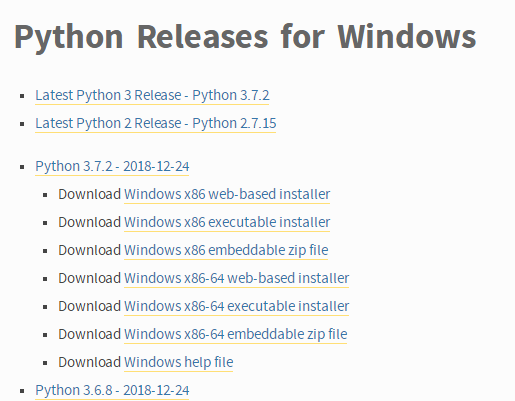
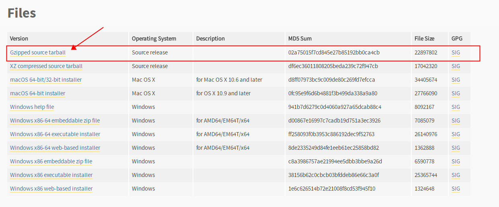

# Python3 概览

Python 是高级、解释性、交互性和面向对象型的脚本语言。Python 被设计成可读性良好的语言。

- Python 是解释性语言 —— Python 由解释器在运行时进行处理。不需要在执行它之前进行编译，有些类似 PERL 和 PHP。
- Python 是交互性语言 —— 可以直接在一个 Python 提示符前与解释器交互来进行编程。
- Python 是面向对象型语言 —— Python 支持面向对象风格。
- Python 是"初学者"的语言 —— Python 是一种支持简单文本处理、web应用开发的适合初学者的开发语言。

## Python 的历史

Python 是被 Guido van Rossum 在80年代末90年代初在荷兰的数学与计算机国家研究所设计并开发的。

- Python 基于其他很多语言而开发，包括 ABC、Mudula-3、C、C++、Algol-68、SmallTalk 和 Unix shell 以及其它脚本语言。
- Python 是有版权的。 像 Perl、PHP一样，Python 源代码现在使用的是 GNU General License（GPL）公共许可证。
- Python 仙子啊被一个核心开发团队维护。
- Python 1.0 在1994年发行。2000年发行了 Python2.0.
- Python 3.0 在2008年发行。Python 3不在向前兼容Python2.

## Python 的特性

- 容易学 —— Python 关键字不多，结构简单，语法定义清晰。允许学生可以快速上手学习。
- 容易读 —— Python 代码清晰定义和可读性良好。
- 容易维护 —— Python 源代码相当容易维护。
- 广泛的标准库 —— Python的大部分库在UNIX、Windows和Ma上都是非常可移植和跨平台兼容的。
- 交互模式 —— Python 支持交互模式下允许交互测试和debug代码小片段。
- 可移植性 —— Python 可以运行在很多硬件平台，在所有的平台上都有相同的接口。
- 可扩展性 —— 你可以向Python解释器中添加低级模块。
- 数据库 —— Python 提供了接口支持大多数主流数据库。
- GUI 编程 —— Python 支持 GUI 应用，并且可以移植到其他系统使用。
- 伸缩性 —— Python提供了比shell脚本更好的结构和对大型程序的支持。

除了以上特征之外，Python 还有其他的特征：

- 像支持OOP一样，也支持函数式和结构式编程。
- 可以作为脚本语言，也可以为构建大型应用而编译成二进制代码。
- 提供了很多高级动态数据类型，支持动态类型检查。
- 支持自动垃圾回收。
- 很容易和 C、C++、COM、ActiveX、CORBA 和JAVA 集成。

## Python3 环境安装

Python3 支持 Windows、Mac OS 和大都数 Linux 操作系统。

### 本地环境设置

打开一个终端窗口，并输入 “python” 可以发现机器是否已经安装过python了。


### 获取 Python

#### Windows 平台

可以到 Python 官网下载适合Windows版本的安装包。
下载地址： https://www.python.org/downloads/windows/




#### Linux 平台

在 Ubuntu 中，使用如下命令安装：
```shell
sudo apt-get install python3-minimal
```
从源码中安装：
下载gzip压缩包哦，https://www.python.org/downloads/release/python-372/ 找到界面：


```shell
wget wget https://www.python.org/ftp/python/3.7.2/Python-3.7.2.tgz
tar xvfz Python-3.7.2.tgz
cd Python-3.7.2
sudo yum install openssl-devel   -y
sudo yum install zlib-devel  -y
./configure --prefix=/opt/python3.7.2
make  
sudo make install
```

#### Mac OS 平台

下载 MacOS 安装包, https://www.python.org/downloads/mac-osx/:


#### Python 官网： https://www.python.org/

你可以下载Python文档，HTML、PDF 格式都有。


#### 设置 PATH

程序和其他可执行文件可能存在于很多目录中。因此，操作系统提供了一个可搜索的目录清单，以供执行时查询使用。

重要的特征如下：
- path 存储在环境变量中，环境变量被以字符串的形式在操作系统中维护。环境变量包含了命令行shell和其他程序的信息。
- path 变量在Unix中被命名为 **PATH**，在windows 中命名为**Path**。 Unix中是大小写敏感的，windows不敏感。
- 在 Mac OS 中，安装程序处理细节。 为了从任何指定的目录调用 Python 解释器，你必须添加 Pyhon 目录到你的 path 中。

#### 在 Unix/Linux 中设置 Path

- 在 csh sehll 中设置： 设置环境变量 ： **setenv PATH "$PATH:/usr/local/bin/python3"**
- 在 bash sehll(Linux) 中设置： **export PYTHONPATH=/usr/local/bin/python3**
- 在 sh 或者 ksh shell 中设置： **PATH = "$PATH:/usr/local/bin/python3"**

**注意：** /usr/local/bin/python3 是 Python目录的路径。

#### 在 Windows 中设置 Path

设置环境变量： **path %path%;C:\Python**

**注意：** C:\Python 是 Python 所在目录

#### Python 自身环境变量


|序列号|变量|描述|
|-------|-------|-------|
|1|PYTHONPATH|和系统环境变量 PATH 类似的角色。这个变量告诉 Python 解释器，从哪里导入模块文件到程序中。一般包含 Python 源代码库 和 包含项目源代码的目录。Python 有时候会安装 PYTHONPATH。|
|2|PYTHONSTARTUP|表示一个包含Python源代码的初始化文件的路径。每次启动Python解释器时，都会执行。|
|3|PYTHONCASEOK|在Windows中，告诉Python对输入大小写敏感，可以设置这个变量为任何值来激活|
|4|PYTHONHOME|是一个可选模块用以作为查找路径，通常是嵌入到了 PYTHONSTARTUP 或者 PYTHONPATH 目录中以使得切换更容易切换模块库|


### 运行 Python

有三种不同的方式启动 Python 

#### 解释器交互式启动

可以在命令行或者sehll窗口中使用 **python** 命令。

这里有一些可用的命令行选项：

|序列号|选项|描述|
|-----|------|-----|
|1|**-d**|提供 debug 信息输出|
|2|**-O**|生成优化字节码， 生成 **.pyo** 文件|
|3|**-S**|在启动时查找 Python 路径，不运行导入站点|
|4|**-v**|详细输出(导入语句的详细跟踪)|


#### 脚本执行

一个 Python 脚本可以调用解释器在命令行中执行。

**python script.py**


