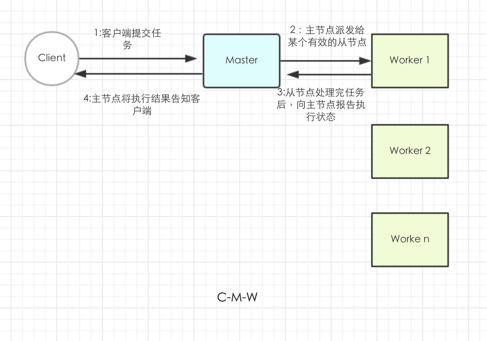

# Zk 入门基础知识

Zookeeper 以下简称Zk。

## Zk 背景

Zk 原本是 Google 的 Chubby 项目的开源实现，曾经是 Hadoop 的子项目，在大数据领域得到了广泛的应用。
Zk 是以 Paxos 算法为基础的，为分布式系统提供可靠的协作处理功能，在互联网公司常用作服务注册与发现中心，其心跳机制应用场景较多。

## Zk 使命

Zk 专注于任务协作，提供了【主节点选举】、【进程存活与否的跟踪功能】实现的工具，开发人员自己决定实现。
Zk 不适用于大量数据的存储，适用少量共享存储元数据的存储。

**分布式系统**：同时跨越多个物理机，独立运行的多个软件组件所组成的系统。
**分布式系统进程通信**：
- 直接通过网络进行信息交换
- 读写某些共享存储数据

>Zk 采用的是第二种即使用共享存储模型来实现应用间的协作和同步原语,对于共享存储本身，又需要在进程和存储间进行网络通信，所以在分布式系统中，网络通信显得比较重要，因为它是分布式系统中并发设计的基础。

## 示例

###  主从应用

**主从架构**：

在这种架构中，**主节点** 负责跟踪从节点状态和任务的有效性，并分配任务到从节点。
这个主从架构阐述了大都数流行的任务，例如 **选举主节点**，**跟踪有效的从节点**，**维护应用元数据**/。

主从模式必须要解决的三个关键问题：

- ***主节点崩溃*** ： 主节点如果崩溃或失效，系统将无法分配新的任务
- **从节点崩溃** ： 从节点崩溃，已经分配的任务就无法完成
- **通信故障** ： 主、从节点无法通信，则从节点无法得知新任务分配给它

为了处理这些问题，主节点出现问题时，系统需要可靠的选举出一个新的主节点、判断哪些从节点有效、判断一个从节点相对于系统其它部分是否失效。

主节点失效时，需要有一个**备份节点**，当主节点崩溃时，备份节点会接收主节点的角色，进行**故障转移**，新的主节点需要恢复到旧的主节点崩溃时的状态。
而对于主节点的可恢复行，不能依靠从已经崩溃主节点来获取这些信息，需要从Zk来获取。

***伪崩溃*** ： 主节点有效，但是备份节点却认为主节点已经失效，这场发生在以下场景：
- 主节点负载很高，导致消息任意延迟很高，备份节点会接管主节点的角色，成为第二个主节点。
- 如果一些节点无法与主节进行通信，比如由于网络分区（network partition）错误导致，与主要主节点停止通信，而与第二个主节点建立通信。

这个场景叫做 ***脑裂（split-brain）*** ： 系统两个或者多个部分开始独立工作，导致系统整体行为不一致。

>客户端向主节点提交请求，主节点找到有效的从节点，从节点处理完将状态报告给主节点，主节点将执行结果通知给客户端：

**从节点崩溃**

还需要解决从节点失效的问题，主节点需要知道那些从节点是有效的，所以要求主节点具有**检测从节点崩溃**的功能。
当从节点崩溃时，从节点处理的任务可能只进行了一部分，也可能没有执行，如果整个过程产生了其他作用，还需要执行某些恢复过程来清除之前的状态。

**通信故障**

如果通信发生故障，比如网络分区导致，从新分配任务给新的从节点执行，可能会发生问题，需要考虑该任务是否能重复执行。
通信故障导致的另外一个问题是对锁等同步原语的影响。因为节点可能崩溃、网络分区等，锁机制也会阻止任务的继续运行。
因此Zk也需要实现处理这些情况的机制：
- 首先，客户端可以告诉Zk某些数据是临时状态的
- 其次，Zk需要客户端定时发送是否存活的通知
- 如果一个客户端未能及时发送，那么所有从属于这个客户端的临时数据都会被删除

### 主从架构的需求

- 主节点选举
- 崩溃检测：主节点必须具有检测从节点崩溃或者失去连接的能力
- 组成员关系管理： 主节点需要知道那些从节点可用
- 元数据管理：主、从节点必须具有某种可靠的方式保存分配状态、执行状态的能力

